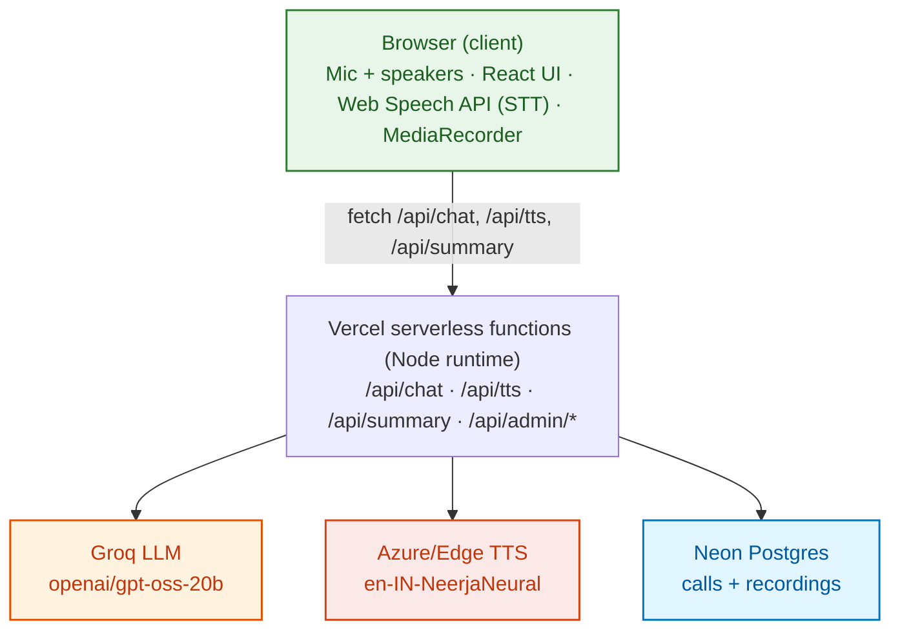
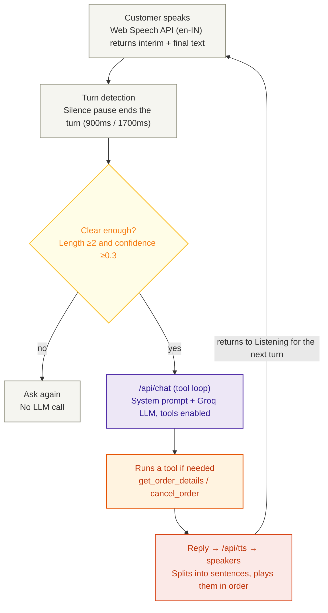

# Aria : Aura Skincare Voice Support Agent
A browser voice agent for a fictional premium Indian skincare brand. Customers click **Start call**, speak, and hear Aria reply in a natural Indian-English neural voice. She answers policy questions, looks up and cancels orders through tool calling, and never promises anything outside policy. Each call's transcript, tool calls, structured outcome and mixed audio recording are stored for admins at `/admin`.

## Link : https://aria-voice-agent-alpha.vercel.app/
## [DEMO LINK](https://drive.google.com/file/d/17ziUuK9q9-oqwjH37qB0LNJOWHMvPLJZ/view?usp=sharing)

## Architecture



## what Happens During One Spoken Exchange ? 

    
### Conversation States
```

```
## Stack rationale
Next.js on Vercel gives HTTPS (needed for the mic), serverless routes and free hosting in one place. Browser STT costs nothing and has low latency in Chrome. Groq's free Llama 3.3 70B is fast and supports tool calling. `msedge-tts` gives a free neural `en-IN-NeerjaNeural` voice, with Azure F0 as an official upgrade. Neon Postgres has a free tier and an HTTP driver that suits serverless functions.

## How tool calls are decided
The model gets two tools and strict rules: no statement about an order without calling `get_order_details`; ask for the ID if it is missing; cancel only after eligibility is `yes` **and** the customer says yes. The server runs up to 4 tool iterations, and the last one forces a text answer.

## Guardrails
Eligibility is computed in code (`lib/orders.ts`); the model only phrases it. `cancel_order` re-checks existence, eligibility and confirmation itself, so even a wrong model call cannot cancel an ineligible order. The prompt restricts answers to the brand facts and the 40 Q&As, with a "don't have that information" rule and prompt-injection resistance. Replies are cleaned of markup and leaked tool syntax. Unclear audio never reaches the LLM. Inputs are truncated and rate-limited per IP.

## Customer vs admin
The customer sees no captions or transcript: just the recorder waveform, the illustrated agent and the call state. Everything is saved for admins: transcript with timestamps, tool calls with arguments and results, the JSON outcome, and the recording (customer mic plus Aria's neural voice, mixed in the browser).

## Local setup
```
npm install
cp .env.example .env.local   # set LLM_API_KEY (and ADMIN_PASSWORD to use /admin)
npm run dev                  # http://localhost:3000 in Chrome/Edge
npm test && npm run typecheck && npm run build
```

## Environment variables
| Var | Required | Purpose |
|---|---|---|
| LLM_API_KEY | yes | Groq (or other OpenAI-compatible) key |
| LLM_BASE_URL / LLM_MODEL | yes | Defaults to Groq + llama-3.3-70b-versatile |
| TTS_VOICE | no | Default en-IN-NeerjaNeural |
| AZURE_SPEECH_KEY / AZURE_SPEECH_REGION | yes | Official Azure TTS tried first |
| DATABASE_URL | yes | Postgres for persistent calls; otherwise in-memory |
| ADMIN_PASSWORD | no | Enables /admin |
| ADMIN_SESSION_SECRET | no | Cookie signing secret |

## Known limitations (honest)
- STT relies on Chrome/Edge's Web Speech API, which sends audio to the browser vendor's servers and does not work in Firefox. Safari support is partial.
- `msedge-tts` uses an unofficial Microsoft endpoint that can change or rate-limit. That is why Azure and browser fallbacks exist.
- Turns that use the browser fallback voice are not captured in recordings.
- Without DATABASE_URL, stored calls disappear on cold starts and are not shared across instances. Rate limiting is per instance.
- Recordings are capped at about 4 MB (Vercel body limit) and stored as base64 in Postgres. Fine for a demo, not for scale.
- No latency numbers have been measured; speed depends on Groq, the TTS endpoint and the network.
- Barge-in needs headphones. Echo cancellation alone isn't reliable with open speakers.
- Aria answers honestly if asked whether she is a person (she's a virtual assistant). The UI states that calls are recorded.

## Q&A
### **1. Why did you choose this architecture and technology stack?** 
I chose a simple modular architecture so that each part of the voice agent is easy to understand, test, and improve. The system follows a clear flow : the browser listens to the customer, the speech is converted into text, the LLM understands the request and uses the order lookup tool when needed, and the response is converted back into speech. I used Next.js because it allows the complete application to be deployed as a single project on Vercel, which keeps the setup simple and suitable for the project. I also used browser-based speech recognition and free-tier AI services to keep the project easy to deploy without requiring a separate telephony or backend server.

### **2. What was the most difficult part, and how did I solve it?** 
The most difficult part was making the conversation feel like a natural voice interaction rather than a normal text chatbot. The main challenge was managing when the agent should listen, think, and speak without continuously hearing its own voice. I solved this by controlling the conversation through clear states such as Listening, Thinking, and Speaking. While Aria is speaking, microphone recognition is temporarily paused to reduce echo, and after she finishes, listening starts again. I also added handling for unclear speech, invalid order IDs, missing order IDs, and failed API responses so the agent can recover gracefully instead of crashing or giving made-up information.

### **3. With one more week, what would I improve first, and why?** 
I would improve the voice experience and response speed first because these have the biggest effect on how natural the agent feels. I would move towards real-time streaming so that Aria can start speaking while the response is still being generated, instead of waiting for the complete response. I would also improve interruption handling so that customers can naturally interrupt Aria while she is speaking. After that, I would add more automated testing for the common questions, policy-related conversations, invalid orders, and unusual customer requests to make sure the behaviour stays consistent when the model or prompts are changed.

### **4. At 1,000 conversations a day, what would need to change?** 
Currently I am on Student Free Tier Subscription for Microsft's Azure Services, for such high conversations I would move to a paid, SLA-backed TTS and STT. At that scale, the main focus would be reliability, security, privacy, and monitoring. The current demo uses mock order data, so a production system would need to connect to a real order system and verify the customer before displaying order information. I would also move from free-tier services to reliable paid speech and AI services with higher limits and better availability. Conversation data would need proper storage, access control, retention rules, and protection of customer information. Finally, I would add monitoring for response time, failed requests, voice errors, and customer resolution so that the system can be continuously improved.

## Approach note
I built the project as a simple browser-based voice support agent with speech-to-text, an LLM for understanding customer requests, order lookup through a tool, and text-to-speech for Aria's response. I kept the Aura Skincare policies and order rules controlled by the application so that Aria can respond naturally without making promises that are not allowed. The complete system is designed to run as a single Next.js application and can be deployed directly on Vercel using free-tier services.
